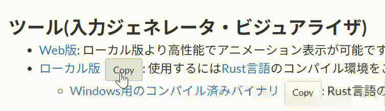

<div align="center">

# AtCoder Zip Copy



AtCoderの問題文中の .zip リンクの横にコピーボタンを追加するユーザースクリプトです。

[](https://opensource.org/licenses/MIT)
[](https://bun.sh/)

[](https://greasyfork.org/ja/scripts/575504-atcoder-zip-copy)


</div>

---

## 概要

AtCoderの課題ページ（問題文）において、リンク先が `.zip` ファイルである場合に、そのURLをクリップボードにコピーするためのボタンをリンクの隣に自動で作成します。

## 機能

- **Copyボタンの追加**: `.zip` リンクの横に「Copy」ボタンを配置します。
- **クリップボードへのコピー**: ボタンをクリックすると、即座にそのファイルのフルURLをコピーします。
- **フィードバック**: コピー成功時にボタンのテキストが1秒間「Copied!」に変わります。

## 使い方

1. Tampermonkey などのユーザースクリプトマネージャーをブラウザにインストールします。
2. 本スクリプトをインストールします。
3. AtCoder の問題ページを開くと、`.zip` リンクの横にボタンが表示されます。

## 開発

### セットアップ

```bash
bun install
```

### 開発用サーバーの起動

```bash
bun run dev
```

### ビルド

```bash
bun run build
```

`dist/atcoder-zip-link.user.js` が生成されます。

## 謝辞

- [AtCoder Title Copy](https://greasyfork.org/ja/scripts/434033-atcoder-title-copy)
ボタン作成のコードを参考にさせていただきました。

## ライセンス

[MIT](LICENSE)
